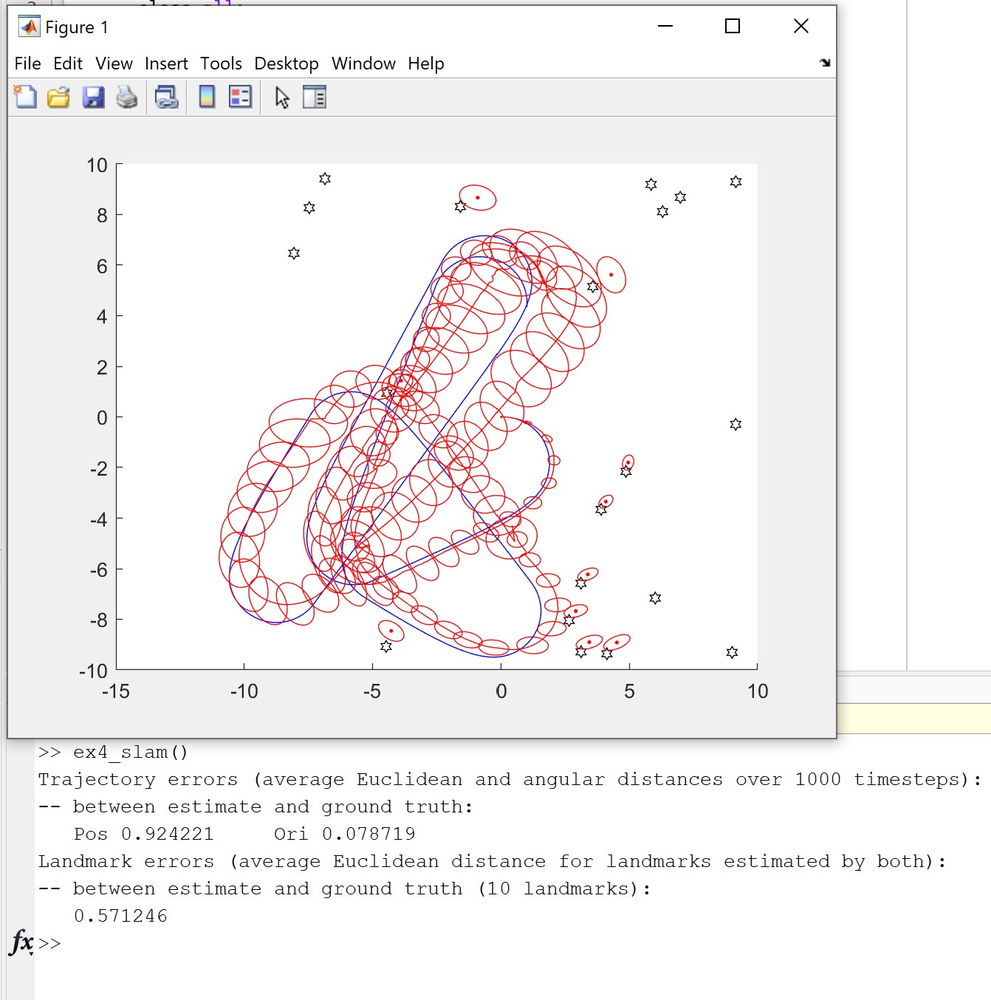

# hardware-accelerated-slam
Implementation of SLAM for PYNQ platform

## March 27th update

### Converting matlab to Python

This update will focus mostly on the start of the work implementing a hardware component as well as an update on the state of the software implementation. Since the last update, the matlab implementation is in the process of being moved to python. The graphing implementation is completely ported to python and the algorithm is about a third of the way done. In a similar theme as the last update, it is proving to be a significant amount of work to move the SLAM implementation to python. 

### Existing IP as a starting point

Most of the work since the last update has been related to implementing a hardware component. One of the critical operations for the SLAM algorithm is large matrix multiplications of various sizes to calculate the kalman gain and update the predicted state and covariance. Since matrix multiplications is a common mathematical operation there is already an extensive amount of IP that is openly available to that can serve as a starting point for my work. The vitis HLS and vivado projects are located in `/hardware/matmult-master` and `/hardware/project_1` respectively. For compatibility with Github file path length restrictions, these folders have been zipped to be committed. 

The existing IP that I chose to base my work on is an implementation posted on Github called matmult posted by the user twaclaw. The project posted has an optimized hardware implementation of a matrix multiplier with matrices sized 128x128. This is far larger than what is needed for my algorithm and thus the first step was to reduce the size. Unfortunately, while the original was about 3 times faster than numPy's matrix multiplication for that size, reducing the hardware to support 64x64 matrices reduced the comparative speed to be about equal between hardware and software. Below are two screenshots of the hardware running compared to a software implementation showing the timing of the operations. 

Because of the smaller matrices, it is possible that the hardware's speed could be improved by using more area than what was possible with the larger matrices. This work is ongoing. 

### Driver to support arbitrary sized matrices    

The other aspect for implementing hardware matrix multiplications is the need to support matrices of changing sizes. The state and covariance matrices grow as the algorithm runs and thus requires matrix multiplications of different sizes. A driver is needed to construct matrices of the same size as the hardware to perform the multiplication then extract the result for the original matrices from the larger result. The python implementation of this is located in `/hardware/matmult_driver.py`. The code to support matrices of arbitrary size along with the hardware interface can been seen in `/hardware/matmult-64.ipynd`. The screen shot below shows the code running. Unfortunately, the operations to construct the larger matrix are quite slow and thus supporting arbitrary size matrix multiplications is much slower than a single size natively supported by the hardware. There is also currently a limitation in that the matrices must be square, the algorithm requires multiplying non square matrices and thus this must be changed to allow that. 

## March 2nd update

The current state of my project is that the slam algorithm is implmented in Matlab along with functions to plot and anlyze the result of the algoithm to determine if it ran correctly. The implmentation of the algorithm istelf is done in `E3.m`. The file `ex4_slam.m` contains the top level function which calls the slam algorhtm as well as the functions to plot the output. The graphing functions are implemented in `visualize.m`. The graphing function also calculates the average error between the calculated robot and landmark positions comapred to the ground truth. 

The inputs to the algoithm are loaded in with 2 `.mat` files. These inputs are in the form of ground truth for the landmarks and robot for T timesteps. The inputs also contain parameters about the simulated sensor that the robot "uses" for the slam calculations, this includes a max range and sensor noise. The input also includes a sensor noise for the measured robot movement per time step. The slam algorithm returns the calculations for the location and confidence for each landmark the robot saw in addition to the location and confidence of the robot for each time step.

In the sample output above, the black stars represent the landmarks true location with the calculated locations represented as red dots with the ellipse representing thier confidence. Similarly, the blue line represents the ground truth of the robot with red ellipses representing the confidence for the each timestep.

### Running the Matlab implementation

To run the Matlab implmentation, you must first clone the repository, and then open Matlab to the folder `/hardware-accelerated-slam/`. In the Matlab Command Window, run the top-level function using the following command: `ex4_slam()`. This should produce an output similar to the image above.  

### Python implementation

There was a more than expected amount of effor that went into decoupling this implementation, mostly relating to the graphing functionality, from a Matlab specific toolbox. This is a nessecary step in moving the functionality to Python but it means that the Python implmentation is not functional yet. Most of the operations for matricies in matlab can be replaced by the NumPy library so many of the functions can be directly replaced. There is still more work to be done with smaller implmenation details such as starting indicies and graphing the output using a python plotting library. This work has been started in the similarly named python files to thier matlab equivilent and are located in `/slam_python/`